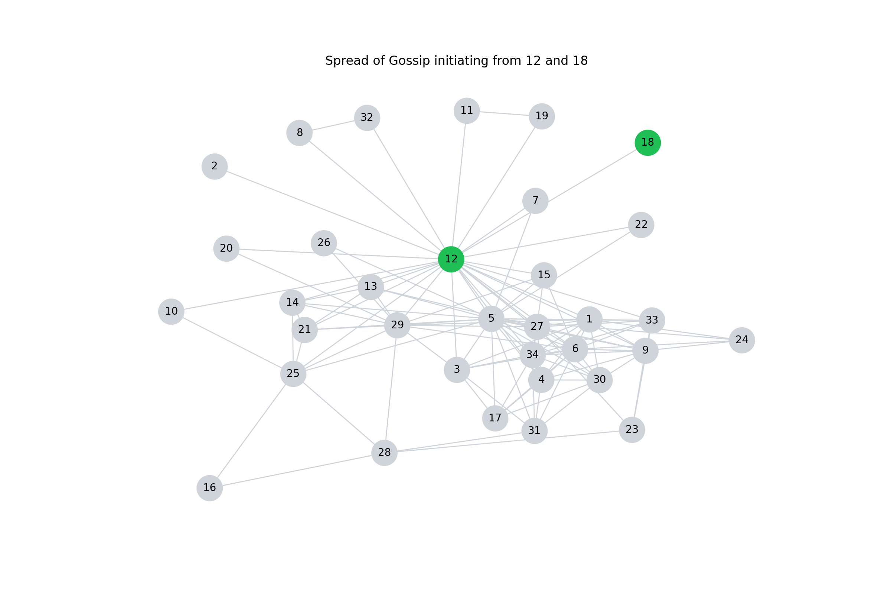

# Friendship Network and Information Diffusion
I used social network analysis and graph theory to analyze my friends’ network. In that project I used common social network analysis measures for identifying key nodes in the network, detecting communities and finally analyzing effect of node removal on entire network.
In this project, I explore standard information diffusion models and also models that I defined to see how information flows in my network. I specifically model the diffusion of “gossip”.  
For simplicity, the edges between nodes are undirected and unweighted. 

This is my network and you can find the nodes and edges in the `Models` class. 

## The Models: 

Since at the end I will try to model spread of the gossip, it is useful to have a definition of it here:
#### :memo: What is gossip:
Gossip is defined as information passed between two individuals $A$ and $B$ about a third individual $C$ which effects the strengths of all three relationships: it strengthens $\text{A-B}$ and weakens both $\text{B-C}$ and $\text{A-C}$ [1].
In models defined in `src/diffusion/diffusion_models.py` I don’t specifically analyze the effect of gossip on the strength of the edges between nodes, but only how information flows in the network based on some criteria. 

Here are the models:

### 1. Independent Cascade Model:
The independent cascade model is an information diffusion model where the information flows over the network through cascade. Nodes can have two states, active: it means the node is already influenced by the information in diffusion, inactive: node is unaware of the information or not influenced [2]. 

In a simple version of this model, I compared two numbers with each other. One is the probability of a node getting activated and second is a random number between 0 and 1. Instead of node activation probability I used **degree centrality** of the node as a threshold for a node getting activated. Whenever the random number is less than the activation threshold of a node, then that node will get activated. 

This method incorporate randomness of spreading of information in social networks. However, in real world networks and specifically in networks in which node has meaningful relations like “friendship” randomness does not model the spread of the information properly. 

#### :warning: Issues of this method:
In this modeling, initiator nodes were 12 and 18. I chose these nodes because node 18 only has one connection in the network and that’s the edge 12-18. Since I assume that node 12 will participate in spreading the information only once, then spreading information from node 12 to other nodes in the network is not acceptable. Node 12 only activates node 18, and then node 18 must continue the activation of other nodes and since it does not have any other connections, spread of information in the network must stop at node 18. The result of spreading information in the network initiating from node 12 and 18 is as follows:

Node 12 must be removed from further participation in spreading the information, and even though we apply this restriction we still have another problem. The random number will be sometimes greater than node 18’s degree centrality and sometimes less. This means in every run we may get different results. 

To overcome this issue I defined the following methods:

### 2. Common Neighbors Influence

As before in this method, I use degree centrality as a threshold of a node getting activated. But instead of using a random number to see which node gets activated, I use an index that I defined as follows:

$$\text{CN Index} = \frac{\text{Number of common neighbors of node i and j}}{\text{Total number of neighbors of node j}}$$

This index is called Common Neighbors Index. To define it I assumed that when a node gets information from other nodes, particularly, when this information can be considered as gossip, the activation of that node (which means participation in spreading of it) is related to the importance or influence of the sender node. Therefore, when sender and the receiver has more common neighbors, we can assume these are part of a community in the network and thus it is more likely that these two nodes will share the information with each other. The index is also between 0 and 1 and you can find the implementation of this model in `common_neighbors_influence` method of `Models` class. 

When a node gets activated, it gets removed from the further spread of the information, and new active nodes try to activated other nodes as much as they can. 

When `cn_index` is greater that degree centrality of the destination node, the the destination node will be activated. The reason is that `cn_index` is a measure of the importance or influence of the sender node, and when the influence of a node is greater than the centrality of the receiver node, we can assume that receiver node is under influence of the sender node, and thus receiver will be activated. 
For example, consider the same nodes 12 and 18 in my network. These two nodes are initially active. Node 18 attempts to spread the information to other nodes in the network, and since this node is only connected to node 12, and the node 12 is already active, the process of spreading the information stops at node 18. 
Now consider another node in the network. Using social network analysis’ measures we know that node 5 is one the most important node in the network. Every centrality measure for this node has a high values. In the simple ICM model, there is no distinction between node 18 and node 5 when it comes to spreading information. But in this model, all the nodes that are in the community of node 5, get activated.

#### :warning: Issues of this method:
This method can model the spread of information in the network better than simple version of ICM. In the case of node 5, when its the second active node, model can simulate the spread of information as I expect. But when another important node, such as 27, starts the spreading the information, node 5 get activated as third node. Here I expect node 5 to spread the information as before, the process gets stopped at this level and we end having only three active nodes, 12, 27, and 5. The reason for this is the adjacency of node 12. When node 5 becomes third active node, in the process of calculating the `cn_index` it loses some of its connections from first node, and therefore the index becomes smaller and thus it cannot activated the forth node. I think it is logical, but I also believe this should happen. 

Here is the the graph of active nodes. The left graph depict the spread of information when node 12 and 5 are initial active nodes, and the right graph shows the spread of information when node 12 and 18 are initial active nodes. In these cases my model seems to perform better:

  
  

### Resources:
1. [The Effect of Gossip on Social Networks](https://wiki.santafe.edu/images/4/4a/Gossip.pdf).
2. [Influence Maximization in the Independent Cascade Model](https://ceur-ws.org/Vol-1720/short9.pdf)

