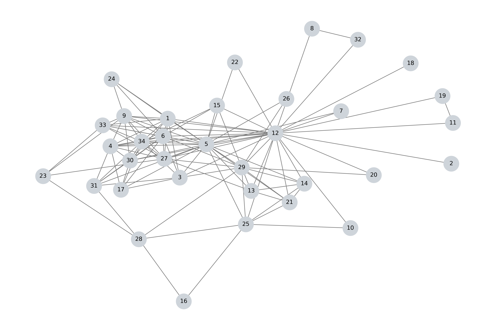

# Friendship Network and Information diffusion

This project is a subsequent of another project in which I analyzed my friends network using Social Network Analysis and Graph theory. In that project I used common measures for identifying key nodes and edges in the network and I also explored other measures and as well as effect of removing nodes from the network.

I read a paper few years ago in which they modeled the dynamics of spreading gossip in the networks. 

In this project I use some of the available methods to analyze the spread of gossip and in general information, in my network. 

My network consists of 34 nodes with 119 edges. For simplicity I defined a simple undirected and unweighted graph.

### About this projcet

For modeling information diffusion in my network, first I use a simple model which is called **Independent Cascade Model (ICM)**.

## Information Diffusion 

Information Diffusion in social networks referes to process by which information spreads from one node to anther nodes within the network. Studying information difussion and identifying the processes of it, is important because it can help us to understand how nodes are interacting with each other. This can be useful in the fields such marketing, public health, and social sciences.

### Independent Cascade Model

This models is a simple probabalistic model used to simulate the spread of **influence** through the network. This method was introduced by Kemple et al. in 2003. It is specially useful in fields like epidemiology, viral marketing, and social netowrks. 

How ICM works:
1. *Initial Activation*: The process of modeling starts with a set of nodes that are initially activated. Activation here means two or more nodes are engaged in spreading the information. Since I am studying spread of gossip on my network, I will use gossip instead of information from now on. For example in my modeling in the `src` folder, I defined nodes 12 and 5 to be initially activated. 

2. *Activation Process*: When a node $i$ becomes active, it has a single oppurtunity to activate all its inactive neighbors. For instance, if active node $i$ had two inactive neighbors $j$, $k$, it will attempt to activate those two nodes. Meaning, it will try to spread the gossip to these two nodes. In some models the categorize the nodes in three classes of Initiator, Ignorant, and Infected. The Ignorant nodes are inactive and do not participate in spreading the gossip, which means they are not influenced by the influnce of their active neighbors. Here the probability of activation makes sense, because not all the nodes have the same role in social networks.

3. *Sequential Attempts*: If node $i$ successfully activates node $j$ and node $k$, each of these new activated (or infected) nodes will try to activate their own neighbors. It is important to note, regardless of the result of activation one node only can attempt once to activate other nodes.

4. *Termination*: The process continues until no further activations are possible, meaning all potential activations have been exhausted.

I mentioned that $p(i, j)$ is the probability of node $j$ getting activated by node $i$. This probability is often defined as a weight associated with the edge connecting $i$ to $j$. I think this is not a good choice, because there is another more comprehensive and sophisticated measures for influence that can be used as the probability of a node getting activated. This measure is called **Eigenvector Centrality** and is usefull for assessing a node's influence on its neighbors. 

In the `src/measures/measures.py`, I defined a function for ICM. In this algorithm I compare a random number between 0 and 1 with the probablity of a node getting activated. In a general network where the nodes are not friends, randomness can capture the random nature of spreading of the gossip in the social network. Gossip spreading in real life is not deterministic, and a person can choose to spread the gossip based on various factors that can be modeled probabilistically. 

In my case, where I study my friendship network, nodes have a preference for spreading the gossip and have favorate nodes as destination nodes. This means they will spread the gossip to nodes they feel close to. This is exactly why I will try to eliminate this randomness from my network of friends. In the image below you can see the network. 

## Degree Centrality
First I used degree centrality of the nodes as the probabiltiy of a node getting activated by the node who is already active. Let's have a look at a graph of activated nodes. In this run nodes that are initially active, were 12, and 18. I chose this nodes, because the destination node (18) has only one connection to to node 12 and does not have any connections with other nodes of the network. It is very unlikely that node 18 can spread the gossip as shown in this chart. The randomness does not model this case well:

